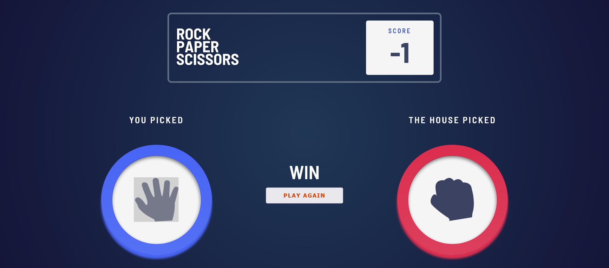

# Frontend Mentor - Rock, Paper, Scissors Game

This is a solution to the [Frontend Mentor Rock, Paper, Scissors challenge](https://www.frontendmentor.io/challenges/rock-paper-scissors-game-pTgwgvgH). This project is built with React and aims to provide a fun and interactive game experience following the classic rules of Rock, Paper, Scissors.

## Table of Contents

- [Overview](#overview)
  - [Screenshot](#screenshot)
  - [Links](#links)
- [Features](#features)
- [Installation](#installation)

## Overview

### Screenshot



### Links

- Live Site URL: [Live](https://rock-paper-scissors-beryl-tau.vercel.app/)

## Features

- Choose between Rock, Paper, or Scissors.
- Play against the computer, which makes a random choice.
- Keeps track of the score.
- Responsive design that works well on mobile and desktop.

## Installation

1. Clone the repository:

   ```bash
   git clone https://github.com/anshul393/rock-paper-scissors.git
   ```

2. Navigate to the project directory:
   ```bash
   cd stone-paper-scissor
   ```
3. Install dependencies:
   ```bash
   npm install
   ```
4. Start the development server
   ```bash
   npm start
   ```
